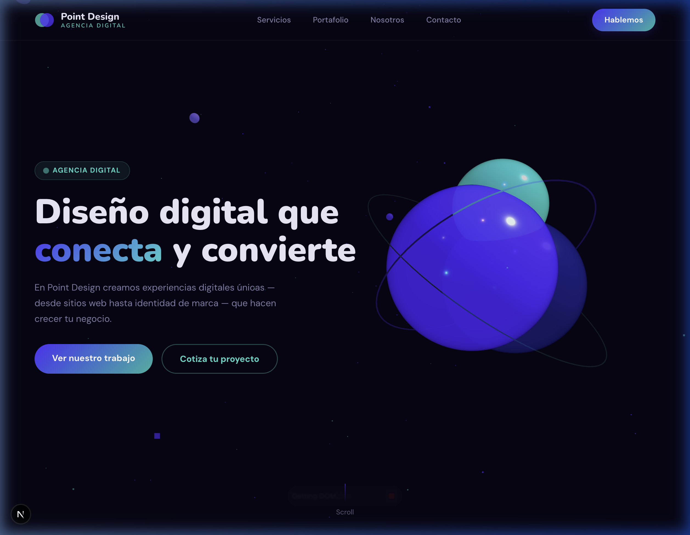

<div align="center">
  '

  # 🚀 Point Design - Digital Agency
  
  *Transforming ideas into high-end digital experiences.*

  [](https://nextjs.org/)
  [](https://supabase.com/)
  [](https://threejs.org/)
  [](https://www.typescriptlang.org/)
  [](https://vercel.com/)
</div>

---

## 🌟 Overview

**Point Design** is a state-of-the-art digital agency website built with the modern web stack. It features a premium design with 3D immersive experiences, a custom CMS for blog and portfolio management, and a robust backend powered by Supabase.

## ✨ Key Features

- **🎨 Premium UI/UX**: Crafted with modern aesthetics, glassmorphism, and smooth animations.
- **🌀 3D Hero Scene**: Immersive Three.js background with interactive spheres that react to mouse movement.
- **📰 Custom CMS**: Integrated Admin Dashboard to manage blog posts and portfolio projects seamlessly.
- **🔒 Secure Authentication**: Robust login system with Supabase Auth and protected admin routes via middleware.
- **⚡ Performance First**: Optimized with Next.js 14 App Router, Server Components, and SSR for SEO.
- **📱 Responsive Design**: Fully optimized for all devices, from mobile to ultra-wide screens.

## 🛠️ Tech Stack

- **Framework**: [Next.js 14](https://nextjs.org/) (App Router)
- **Database & Auth**: [Supabase](https://supabase.com/) (PostgreSQL + RLS + Storage)
- **Styling**: [CSS Modules](https://github.com/css-modules/css-modules) (Scoped styling)
- **3D Graphics**: [Three.js](https://threejs.org/) (Custom hook implementation)
- **Deployment**: [Vercel](https://vercel.com/)
- **Language**: [TypeScript](https://www.typescriptlang.org/)

## 📂 Project Structure

```text
src/
├── app/                  # App Router - Routes & Layouts
│   ├── (public)/         # Public routes (Landing, Blog, Portfolio)
│   └── (admin)/          # Protected Admin CMS routes
├── components/           # Reusable UI & Layout components
├── hooks/                # Custom hooks (including useHeroScene.ts)
├── lib/                  # External services (Supabase client/server)
├── styles/               # Global tokens and CSS resets
├── types/                # TypeScript interfaces and Supabase types
└── actions/              # Server Actions for CRUD operations
```

## 🚀 Getting Started

1.  **Clone the repository:**
    ```bash
    git clone https://github.com/luuzuriaga/pointdesign.git
    cd pointdesign
    ```

2.  **Install dependencies:**
    ```bash
    npm install
    ```

3.  **Setup environment variables:**
    Create a `.env.local` file and add your Supabase credentials:
    ```env
    NEXT_PUBLIC_SUPABASE_URL=your_supabase_url
    NEXT_PUBLIC_SUPABASE_ANON_KEY=your_supabase_anon_key
    SUPABASE_SERVICE_ROLE_KEY=your_service_role_key
    ```

4.  **Run the development server:**
    ```bash
    npm run dev
    ```

## 📄 License

This project is specialized for **Point Design Agency**. All rights reserved.

